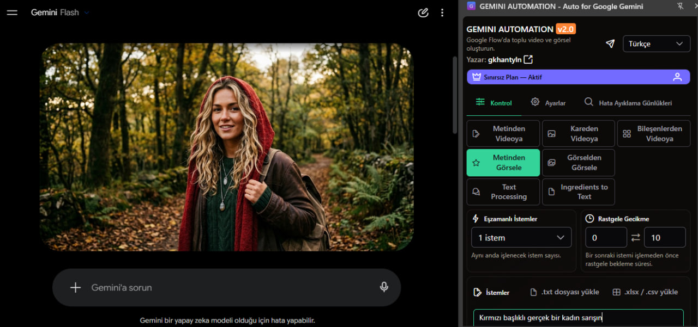

# GEMINI AUTOMATION v2.0 — Auto for Google Gemini

<p align="center">
  
  
  
  
  
</p>

<p align="center">
  <strong>Batch generate and auto-download responses & images on Gemini — Turkish, Unlimited, Offline, Open Source</strong><br/>
  Author: <a href="https://github.com/gkhantyln">gkhantyln</a> • Contact: <a href="https://t.me/llcoder">t.me/llcoder</a>
</p>



> **GEMINI AUTOMATION** is a Chrome Extension that automates Google Gemini at scale. Paste dozens of prompts (text-to-video, image-to-video, text-to-image...) and let it batch-generate, auto-retry and auto-download on `gemini.google.com` — **without login, without limits, fully offline.**

---

## ✨ Highlights

| Feature | Details |
|---|---|
| **∞ Unlimited** | Daily limit removed (`limit:999999`). No `Premium` upgrade, no paywall. `Sınırsız Plan — Aktif` always on. |
| **Offline First** | Remote config `configs.kylenguyen.me` bundled locally (`hash: offline-gkhantyln-v2`). No `fetch` required. `api/auth` disabled (`_d`/`Bd` → `Pd/!0`). Works with no internet after install. |
| **Türkçe by Default** | `Vc="tr"`, `fallbackLocale:["tr","en"]`, language selector now includes `Türkçe` + 6 languages. Every string translated (`tr:{...}`). |
| **Gemini Native** | Selectors `rich-textarea`, `arrow_upward`, `model-response` kept in sync. Content-script `assets/index.ts-B5Vf3eNf.js` injected on `*://gemini.google.com/*`. |
| **No Tracking** | `kylenguyen.me` 0 occurrences. Only `github.com/gkhantyln` + `t.me/llcoder`. `update_url` disabled (`checkForUpdate:async()=>{}`). |
| **Branded** | `VEO AUTOMATION` → `GEMINI AUTOMATION`, `v1.2.5` → `v2.0`, new gradient `G` icon (violet → indigo, `logo.png` 512px), violet/orange palette replaces green/yellow. |
| **Open Source** | MIT. Fork → Star → PR welcome. |

---

## 📸 Interface

- **Left:** Gemini Flash generating a forest portrait
- **Right:** Side Panel — `Kontrol / Ayarlar / Hata Ayıklama Günlükleri` — Modes: `Metinden Videoya`, `Kareden Videoya`, `Bileşenlerden Videoya`, `Metinden Görselle`, `Görselden Görsele`, `Text Processing`, `Ingredients to Text` — `Eşzamanlı İşlemler`, `Rastgele Gecikme` — `Sınırsız Plan — Aktif` (violet) `v2.0` badge (fuchsia)

---

## 🚀 Installation

### Chrome Web Store (Manual)
1. Download latest `gemini-automation-v2.0.zip` from [Releases](https://github.com/gkhantyln/gemini-automation/releases)
2. `chrome://extensions` → Developer mode ON → **Load unpacked** → select `VEO_X` folder
3. Open `https://gemini.google.com` → `Ctrl+R` → Side Panel icon → **GEMINI AUTOMATION**

### Dev
```bash
git clone https://github.com/gkhantyln/gemini-automation.git
cd gemini-automation
# no build step — pure JS/CSS
```

---

## 🎮 Usage

1. Open `gemini.google.com` (Gemini Flash / Pro)
2. Side Panel → **Kontrol** → Choose mode:
   - `Metinden Videoya` — text→video (Flow)
   - `Kareden Videoya` / `Bileşenlerden Videoya` — image→video
   - `Metinden Görsele` / `Görselden Görsele` — image generation
   - `Text Processing` / `Ingredients to Text` — text pipelines
3. Paste prompts (one per line or `\\n\\n` separated) or upload `.txt/.xlsx/.csv`
4. Set `Eşzamanlı İşlemler` (concurrent), `Rastgele Gecikme` (0–10s), `Model`, `Aspect Ratio`, `Duration`
5. **Çalıştır** — queue starts, `Hata Ayıklama Günlükleri` shows progress. If `Receiving end does not exist` → refresh Gemini tab.

All outputs auto-download to Chrome Downloads (`gemini-folder-1`).

---

## ⚙️ Settings

`Ayarlar` → `Dil`: `Türkçe` (default), `English`, `Tiếng Việt`, `中文`, `한국어`, `Español`, `日本語` — stored in `chrome.storage.local` `user-locale`.

Other: `concurrentPrompts`, `outputCount`, `promptDelaySecondsMin/Max`, `model`, `videoModel`, `autoDownloadQuality`, `folderName`.

---

## 🏗️ Architecture

```
VEO_X/
├─ manifest.json (MV3, v2.0.0, sidePanel, host_permissions: gemini.google.com)
├─ assets/
│  ├─ index.html-CFx1nEy_.js (side-panel Vue, isPro/!0, limit 999999, Vc="tr")
│  ├─ index.ts-B5Vf3eNf.js (content-script, jQuery, gemini selectors)
│  ├─ remoteConfig-CLW4nOVG.js (offline fallback o={version, selectors})
│  └─ index-BLc8tHC3.css (Tailwind, violet fuchsia palette)
└─ src/ui/side-panel/index.html
```

Key patches for `v2.0`:
- `Jd(){limit:999999}`, `Cu(){isLimitReached:!1}`, `Qd(){isPricingEnabled:!0}`, `Pd/ Od =!0`
- `Sd="offline"`, `remoteConfig r(){return n||o}` — no network
- `checkForUpdate:async()=>{}` — no `Manuel Güncelleme` modal
- `pi pi-sign-out` removed, `discord.gg` → `t.me/llcoder` (`pi pi-send`)

---

## 🤝 Contributing

We love PRs! Unlimited use, open source.

1. **Fork** this repo → **Star** ⭐ (don't forget!)
2. `git checkout -b feat/awesome`
3. Commit & push
4. **Pull Request** — describe your change, we review & merge

```bash
git fork  # or click Fork on GitHub
git clone https://github.com/<you>/gemini-automation.git
git checkout -b feat/my-feature
# ... code ...
git commit -m "feat: my feature"
git push origin feat/my-feature
# Open PR on GitHub
```

Ideas: new Gemini selectors, more languages, better download naming, Flow Veo 3 support.

---

## 📄 License

MIT © `gkhantyln` — Original by `kylenguyen.me`, forked and made unlimited/offline. See [LICENSE](LICENSE).

---

## 📮 Contact

- Author: **[gkhantyln](https://github.com/gkhantyln)**
- Telegram: **[t.me/llcoder](https://t.me/llcoder)**
- Issues: [github.com/gkhantyln/gemini-automation/issues](https://github.com/gkhantyln/gemini-automation/issues)

> **Unlimited — Use freely, fork & star!** If this saved you time, give it a ⭐.

